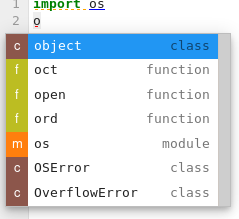
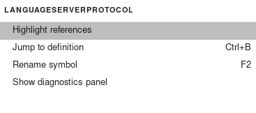
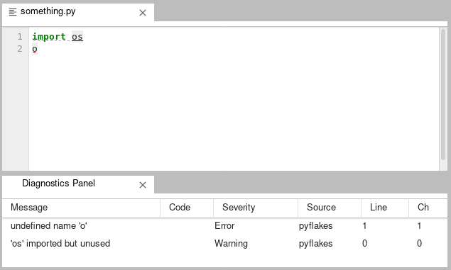
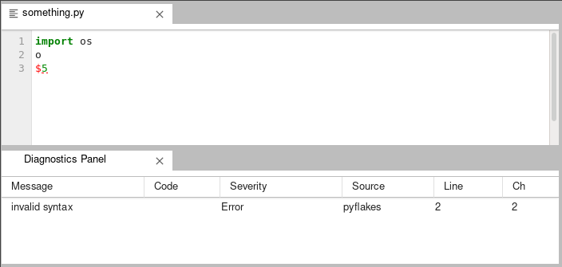

# JupyterLab-LSP test drive (May 2020)

My assessment of the current LSP capabilities of [jupyterlab-lsp](https://github.com/krassowski/jupyterlab-lsp) in May 2020 using Python 3.8.3 on Debian.

The version of relevant packages for this test drive were:

`$ pip freeze | grep -e lab -e lsp -e language`
```
jupyter-lsp==0.8.0
jupyterlab==2.0.2
jupyterlab-server==1.0.7
python-language-server==0.31.10
```

The full output of pip freeze [can be found it versions.txt](versions.txt).

The suggested Python language server is [pyls](https://github.com/palantir/python-language-server), so I used that, but I notice that
the [kite folks disable this in their version](https://github.com/kiteco/jupyterlab-kite/pull/4), so perhaps there are other alternatives to consider.

## Tab Completion

The current implementation does not have the ability to do completion in files on modules. For example, in a new Python file, to make sure no kernel is started or connected and therefore the completitions could only come from LSP:

```
import os
os.<tab>
```

does not work and yields an error in the jupyter notebook server console:
```
ERROR - pyls_jsonrpc.endpoint - Failed to handle request 179
Traceback (most recent call last):
  File "/home/pi/.virtualenvs/jlsp/lib/python3.8/site-packages/jedi/cache.py", line 141, in wrapper
    return dct[key]
KeyError: ((), frozenset())
```

However, `o<tab>` does yield some completions



# Other commands

Additionally, there are four commands available at the moment (these only show up if your selected jupyterlab pane is either a Notebook or a Python file).



- Highlight references
- Jump to definition
- Rename symbol
- Show diagnostics panel

## Highlighting references

This command triggers multiple errors in the notebook server console that look like the following:

```
Bad message (TypeError('not all arguments converted during string formatting')): {'name': 'LabApp', 'msg': "s couldn't write message: %s", 'args': (<LspStdIoWriter(parent=<LanguageServerSession(language_server=pyls, argv=['/home/pi/.virtualenvs/jlsp/bin/pyls'])>)>, 'Content-Length: 218\r\n\r\n{"jsonrpc":"2.0","id":276,"method":"textDocument/references","params":{"context":{"includeDeclaration":true},"textDocument":{"uri":"file:///home/pi/code/pid/wpid/lsp/highlight.py"},"position":{"line":1,"character":2}}}'), 'levelname': 'ERROR', 'levelno': 40, 'pathname': '/home/pi/.virtualenvs/jlsp/lib/python3.8/site-packages/jupyter_lsp/stdio.py', 'filename': 'stdio.py', 'module': 'stdio', 'exc_info': (<class 'BrokenPipeError'>, BrokenPipeError(32, 'Broken pipe'), <traceback object at 0x7f3658674240>), 'exc_text': None, 'stack_info': None, 'lineno': 163, 'funcName': 'write', 'created': 1590606815.4147756, 'msecs': 414.7756099700928, 'relativeCreated': 1358175.628900528, 'thread': 139871523256128, 'threadName': 'MainThread', 'processName': 'MainProcess', 'process': 84827}
    Traceback (most recent call last):
      File "/home/pi/.virtualenvs/jlsp/lib/python3.8/site-packages/jupyter_lsp/stdio.py", line 161, in write
        await convert_yielded(self._write_one(response.encode("utf-8")))
      File "/usr/lib/python3.8/concurrent/futures/thread.py", line 57, in run
        result = self.fn(*self.args, **self.kwargs)
      File "/home/pi/.virtualenvs/jlsp/lib/python3.8/site-packages/jupyter_lsp/stdio.py", line 169, in _write_one
        self.stream.write(message)
    BrokenPipeError: [Errno 32] Broken pipe
```

## Jump to Definition

This also yields a similar error:

```
[E 12:54:15.772 LabApp] Bad message (TypeError('not all arguments converted during string formatting')): {'name': 'LabApp', 'msg': "s couldn't write message: %s", 'args': (<LspStdIoWriter(parent=<LanguageServerSession(language_server=pyls, argv=['/home/pi/.virtualenvs/jlsp/bin/pyls'])>)>, 'Content-Length: 177\r\n\r\n{"jsonrpc":"2.0","id":597,"method":"textDocument/definition","params":{"textDocument":{"uri":"file:///home/pi/code/pid/wpid/lsp/rename.py"},"position":{"line":2,"character":7}}}'), 'levelname': 'ERROR', 'levelno': 40, 'pathname': '/home/pi/.virtualenvs/jlsp/lib/python3.8/site-packages/jupyter_lsp/stdio.py', 'filename': 'stdio.py', 'module': 'stdio', 'exc_info': (<class 'BrokenPipeError'>, BrokenPipeError(32, 'Broken pipe'), <traceback object at 0x7f365c3bba80>), 'exc_text': None, 'stack_info': None, 'lineno': 163, 'funcName': 'write', 'created': 1590609255.7725928, 'msecs': 772.5927829742432, 'relativeCreated': 3798533.446073532, 'thread': 139871523256128, 'threadName': 'MainThread', 'processName': 'MainProcess', 'process': 84827}
    Traceback (most recent call last):
      File "/home/pi/.virtualenvs/jlsp/lib/python3.8/site-packages/jupyter_lsp/stdio.py", line 161, in write
        await convert_yielded(self._write_one(response.encode("utf-8")))
      File "/usr/lib/python3.8/concurrent/futures/thread.py", line 57, in run
        result = self.fn(*self.args, **self.kwargs)
      File "/home/pi/.virtualenvs/jlsp/lib/python3.8/site-packages/jupyter_lsp/stdio.py", line 169, in _write_one
        self.stream.write(message)
    BrokenPipeError: [Errno 32] Broken pipe
```

## Rename symbol

Right-clicking on a symbol in a Python file, and hitting "Rename symbol" pops up a prompt like this:


But yields an error in the console upon submission:
```
[E 12:36:22.900 LabApp] Bad message (TypeError('not all arguments converted during string formatting')): {'name': 'LabApp', 'msg': "s couldn't write message: %s", 'args': (<LspStdIoWriter(parent=<LanguageServerSession(language_server=pyls, argv=['/home/pi/.virtualenvs/jlsp/bin/pyls'])>)>, 'Content-Length: 187\r\n\r\n{"jsonrpc":"2.0","id":373,"method":"textDocument/rename","params":{"textDocument":{"uri":"file:///home/pi/code/pid/wpid/lsp/rename.py"},"position":{"line":2,"character":7},"newName":"y"}}'), 'levelname': 'ERROR', 'levelno': 40, 'pathname': '/home/pi/.virtualenvs/jlsp/lib/python3.8/site-packages/jupyter_lsp/stdio.py', 'filename': 'stdio.py', 'module': 'stdio', 'exc_info': (<class 'BrokenPipeError'>, BrokenPipeError(32, 'Broken pipe'), <traceback object at 0x7f365b9f9bc0>), 'exc_text': None, 'stack_info': None, 'lineno': 163, 'funcName': 'write', 'created': 1590608182.9006987, 'msecs': 900.6986618041992, 'relativeCreated': 2725661.551952362, 'thread': 139871523256128, 'threadName': 'MainThread', 'processName': 'MainProcess', 'process': 84827}
    Traceback (most recent call last):
      File "/home/pi/.virtualenvs/jlsp/lib/python3.8/site-packages/jupyter_lsp/stdio.py", line 161, in write
        await convert_yielded(self._write_one(response.encode("utf-8")))
      File "/usr/lib/python3.8/concurrent/futures/thread.py", line 57, in run
        result = self.fn(*self.args, **self.kwargs)
      File "/home/pi/.virtualenvs/jlsp/lib/python3.8/site-packages/jupyter_lsp/stdio.py", line 169, in _write_one
        self.stream.write(message)
    BrokenPipeError: [Errno 32] Broken pipe
```
## Diagonstics panel

Diagnostics panel observed utility is in providing pyflakes linting warnings and errors.



However, a syntax error in any part of the file excludes all other reports:



## Unresolved / TODO

Does this use custom websockets messaging? [Issue #268](https://github.com/krassowski/jupyterlab-lsp/issues/268) seems to imply so.

You get completion on the notebook without having executed the code. So now there are more ways to get confused. In other words, you will get completions of methods on objects that are defined in cells that aren't executed, and be confused about why the completion works, but the execution of the code does not.